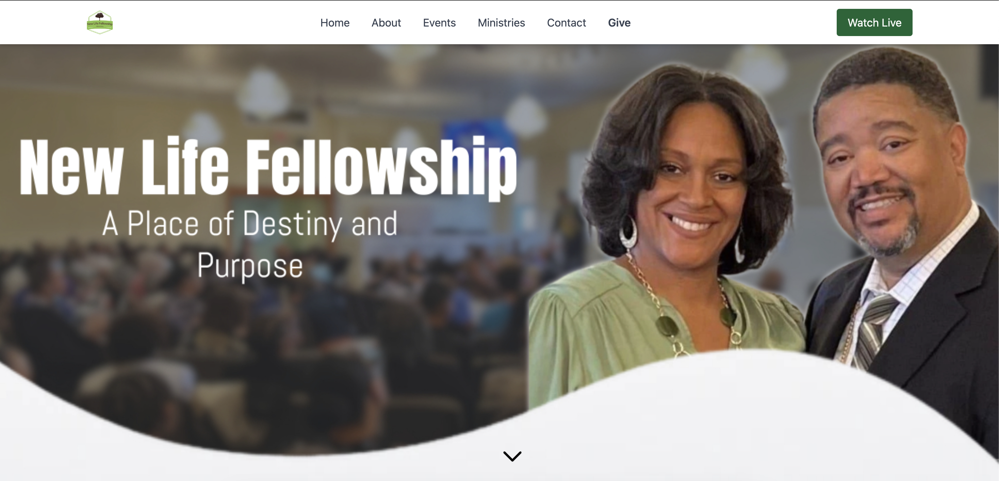
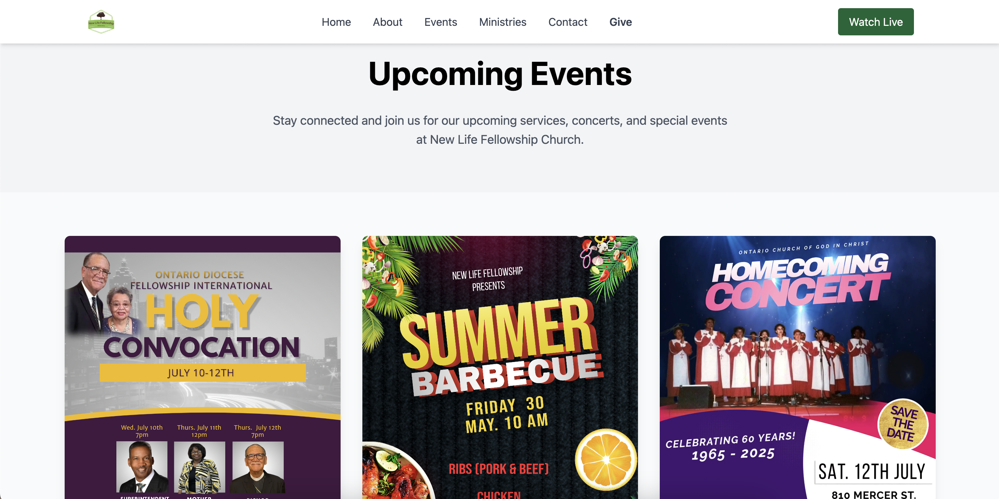
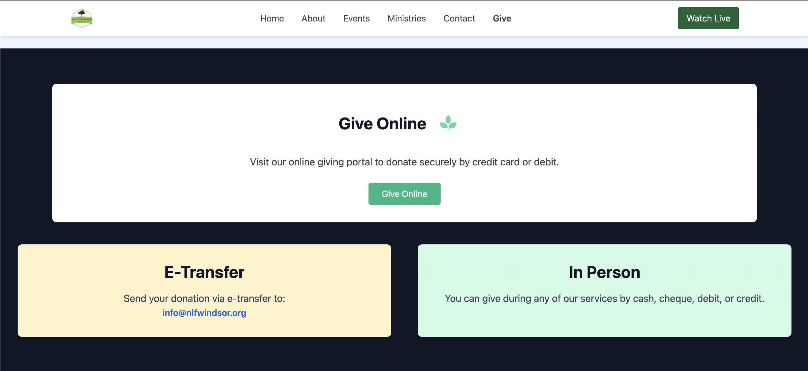

# New Life Fellowship Church Website

A modern, responsive website for New Life Fellowship Church built using HTML and Tailwind CSS. This site showcases our ministry, events, and ways to connect with the church family.

## ✨ Features

- Responsive design optimized for desktop and mobile
- Tailwind CSS styling
- Hero section with background and welcome text
- Services overview (Counseling, Mentorship, Chaplaincy, Preaching)
- Dropdown navigation menu
- Contact section and booking CTA
- Deployed with Netlify

## 🔧 Technologies Used

- HTML5
- Tailwind CSS
- Git & GitHub
- Netlify (for deployment)

## 💻 Screenshots
### Home Page

### Events

### Give 

## 🌐 Live Demo

👉 [Visit the live site](https://newlifefellowshipchurchwindsor.netlify.app)

## 🙏 Developed by: [Sierra Riley](@sierrariley)

